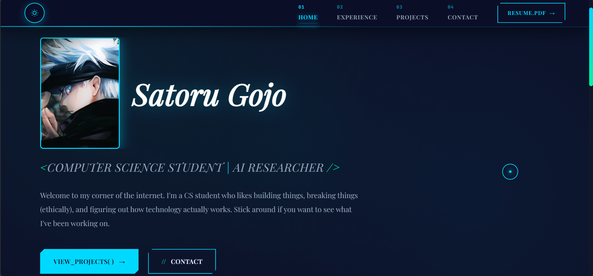
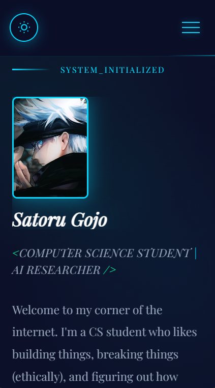

# Modern Portfolio Template

A sleek, cyber-organic themed portfolio website with a terminal-inspired aesthetic. Built with React and Framer Motion, featuring dark/light mode, smooth animations, and a distinctive design that breaks away from generic portfolio templates.




## ✨ Features

- 🎨 **Distinctive Terminal-Inspired Design** - Cyber-organic aesthetic with code-like typography and function call styling
- 🌓 **Dark/Light Mode** - Persistent theme toggle with smooth transitions
- 📱 **Fully Responsive** - Optimized for desktop, tablet, and mobile
- ⚡ **Fast & Modern** - Built with React 18 and Framer Motion animations
- 🎯 **Easy Customization** - Clear code structure with CSS variables
- 📬 **Contact Form Ready** - Easy integration with Formspree, EmailJS, or Web3Forms
- 🔒 **Privacy Policy Page** - Built-in GDPR-friendly privacy policy
- ✨ **Custom Cursor** - Interactive cursor effects on desktop

## 🚀 Quick Start

### Prerequisites

- Node.js 16+ installed
- npm or yarn package manager

### Installation

**1. Clone the repository**
```bash
git clone https://github.com/Jimmy2026/modern-portfolio-template.git
cd modern-portfolio-template
```

**2. Install dependencies**
```bash
npm install
```

**3. Start development server**
```bash
npm start
```
The site will open at `http://localhost:3000`

**4. Build for production**
```bash
npm run build
```

## 🎨 Customization Guide

### 1. Personal Information

**Update your details in these files:**

- `src/pages/Home.js` - Name, bio, education, tech stack (line 8 for typing animation name)
- `src/pages/Experience.js` - Work experience and skills
- `src/pages/Projects.js` - Your projects with detailed descriptions
- `src/pages/Contact.js` - Contact information (email, phone, location)
- `src/components/Navbar.js` - Resume link (line 73)

### 2. Colors & Theme

**File:** `src/index.css`

Edit CSS variables for both dark and light themes (lines 7-32):
```css
:root {
  --electric-blue: #00d9ff;  /* Primary accent color */
  --data-green: #00f5a0;     /* Secondary accent */
  --bg-void: #0a0e27;        /* Dark background */
  /* ... more colors */
}

[data-theme="light"] {
  --bg-void: #d0d8e0;        /* Light mode background */
  /* ... light theme colors */
}
```

### 3. Fonts

**File:** `public/index.html` (line 13)

Replace Google Fonts import with your preferred fonts:
```html
<link href="https://fonts.googleapis.com/css2?family=Your+Font&display=swap" rel="stylesheet">
```

Then update CSS files to use your fonts in:
- `src/index.css` (line 44 for body text)
- Component-specific CSS files for headings

### 4. Profile Image

Replace the placeholder image in `src/pages/Home.js` (line 56):
```javascript

```

### 5. Contact Form Integration

**Option A: Formspree (Recommended - Free)**

1. Sign up at [formspree.io](https://formspree.io)
2. Create a new form and get your form ID
3. Update `src/pages/Contact.js` (line 10):
```javascript
const handleSubmit = async (e) => {
  e.preventDefault();
  
  const response = await fetch('https://formspree.io/f/YOUR_FORM_ID', {
    method: 'POST',
    headers: { 'Content-Type': 'application/json' },
    body: JSON.stringify(form)
  });
  
  if (response.ok) {
    alert('Message sent! I\'ll get back to you soon.');
    setForm({ name: '', email: '', message: '' });
  } else {
    alert('Oops! Something went wrong. Please try again.');
  }
};
```

**Option B: Web3Forms (No signup needed)**
```javascript
const response = await fetch('https://api.web3forms.com/submit', {
  method: 'POST',
  headers: { 'Content-Type': 'application/json' },
  body: JSON.stringify({
    access_key: 'YOUR_ACCESS_KEY',  // Get from web3forms.com
    name: form.name,
    email: form.email,
    message: form.message,
  })
});
```

### 6. Resume

**Option A:** Add your resume PDF to `public/resume.pdf`

**Option B:** Use a Google Drive link (update `src/components/Navbar.js` line 73)

### 7. Privacy Policy

Update contact information in `src/pages/PrivacyPolicy.js` with your email address.

## 📁 Project Structure
```
modern-portfolio-template/
├── public/
│   ├── index.html          # HTML template
│   └── resume.pdf          # Your resume (optional)
├── src/
│   ├── components/
│   │   ├── Navbar.js       # Navigation bar
│   │   ├── Footer.js       # Footer with links
│   │   ├── ThemeToggle.js  # Dark/light mode toggle
│   │   └── CustomCursor.js # Custom cursor effect
│   ├── pages/
│   │   ├── Home.js         # Landing page
│   │   ├── Experience.js   # Work experience
│   │   ├── Projects.js     # Projects showcase
│   │   ├── Contact.js      # Contact form
│   │   └── PrivacyPolicy.js # Privacy policy
│   ├── App.js              # Main app with routing
│   └── index.css           # Global styles & themes
├── package.json
└── README.md
```

## 🚀 Deployment

### Deploy to Vercel (Recommended)

1. Push your code to GitHub
2. Go to [vercel.com](https://vercel.com) and sign in with GitHub
3. Click "New Project"
4. Import your repository
5. Click "Deploy" (Vercel auto-detects React settings)

Your site will be live at `your-project.vercel.app`

### Deploy to Netlify

1. Push code to GitHub
2. Go to [netlify.com](https://netlify.com)
3. Click "Add new site" → "Import from Git"
4. Select your repository
5. Build settings:
   - Build command: `npm run build`
   - Publish directory: `build`
6. Click "Deploy"

### Deploy to GitHub Pages
```bash
npm install gh-pages --save-dev
```

Add to `package.json`:
```json
"homepage": "https://yourusername.github.io/modern-portfolio-template",
"scripts": {
  "predeploy": "npm run build",
  "deploy": "gh-pages -d build"
}
```

Deploy:
```bash
npm run deploy
```

## 🛠️ Built With

- [React 18](https://reactjs.org/) - Frontend framework
- [React Router](https://reactrouter.com/) - Client-side routing
- [Framer Motion](https://www.framer.com/motion/) - Animation library
- [Playfair Display](https://fonts.google.com/specimen/Playfair+Display) - Elegant serif typography
- [JetBrains Mono](https://fonts.google.com/specimen/JetBrains+Mono) - Monospace code font

## 🎯 What Makes This Template Special?

Unlike generic portfolio templates, this project features a **terminal-inspired, cyber-organic design** with function call styling (`work_history()`, `get_in_touch()`), creating a tech-forward aesthetic that feels like an interactive developer environment. The unique combination of elegant serif typography with code-style elements creates a distinctive look you won't find in typical portfolio templates.

## 📝 License

This project is open source and available under the [MIT License](LICENSE).

## 🤝 Contributing

Contributions, issues, and feature requests are welcome! Feel free to check the [issues page](https://github.com/Jimmy2026/modern-portfolio-template/issues).

## 💬 Support

If you find this template helpful, please give it a ⭐️ on GitHub!

## 👨‍💻 Author

**AbdulMalik Shodunke**
- Website: [abdulmaliksho.vercel.app](https://abdulmaliksho.vercel.app)
- GitHub: [@Jimmy2026](https://github.com/Jimmy2026)
- LinkedIn: [@abdulmalikshodunke](https://linkedin.com/in/abdulmalikshodunke)

---

Built with React, Framer Motion, and a passion for distinctive design ⚡